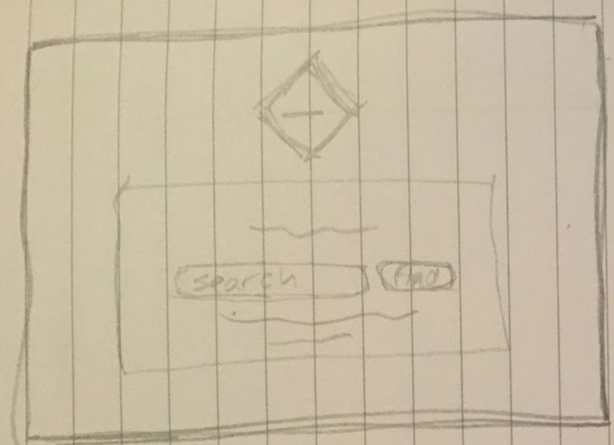
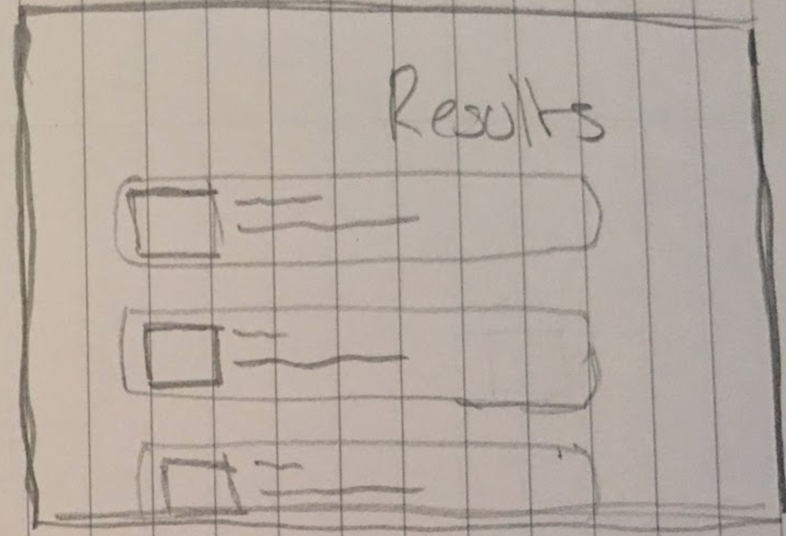
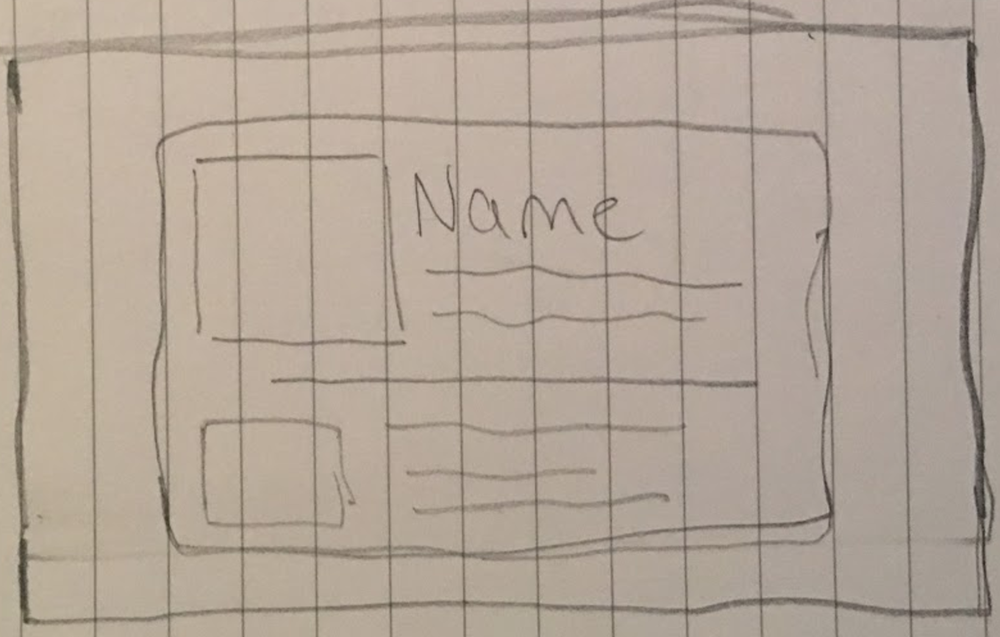
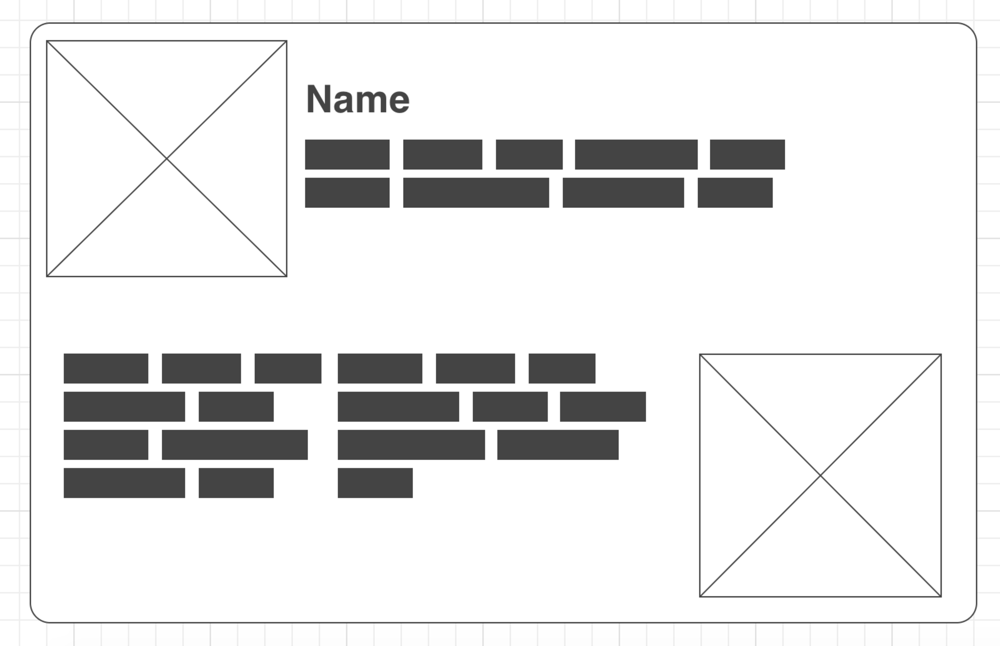
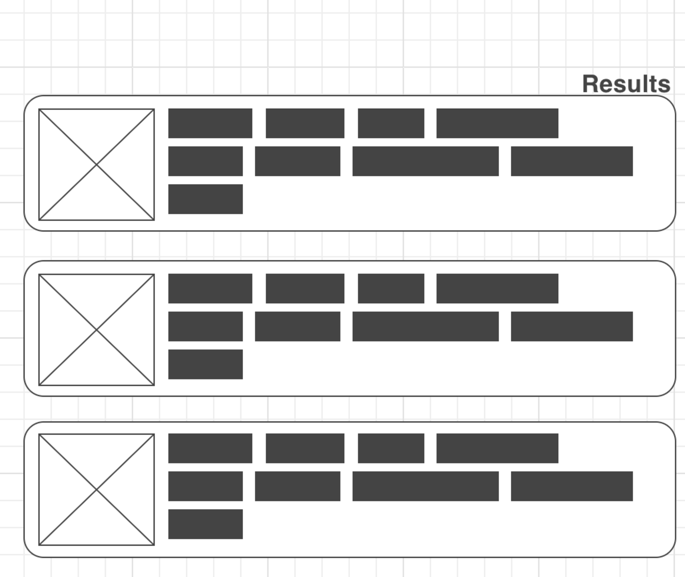
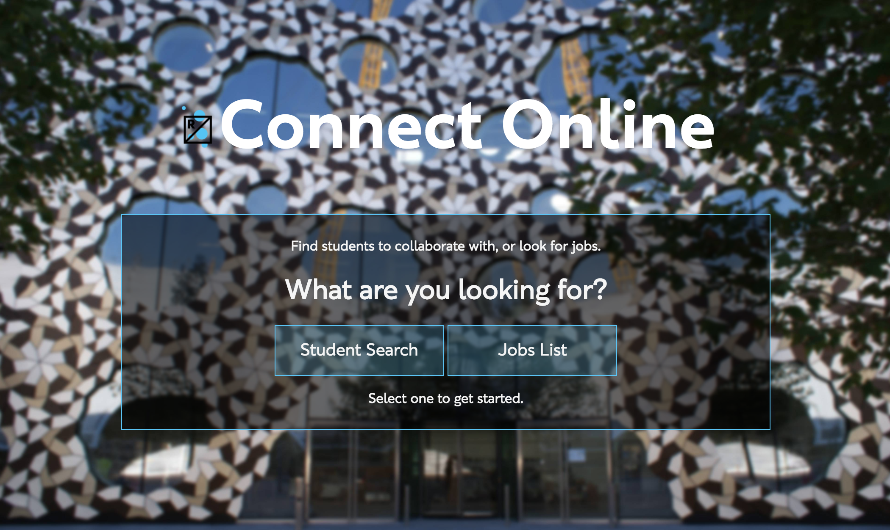

#Filtr Finder
**Name:** Dean Chalk

* [GitHub Link](https://github.com/deanlc/Connect)
* [Pages Link](https://deanlc.github.io/Connect/index.html)

##About this project
For this project we needed to "**make an app that helps people sort through data to find who/what they are looking for.**"

From the early stages I knew I wanted to make an app that was aimed at **students** but I didn't know what it would be, there are already thousands of apps targetting students and I wanted to create something that could be **useful**.

I started thinking about what apps I could make that involved **Ravensbourne** and realised that **Connect** was something people didn't use. So I started looking at what I could do to improve how **Connect** works and put it into an app.

##Prototypes

These are some images of the protoypes I created for the site.

I started off with some basic sketches.

I then turned some of the sketches into wireframes to get a clearer idea of how they'd look.

From these I updated how my app template looked and this was the intial design of the site.

After getting the basic functionality of the site, I found a repository on the Web Media GitHub with all of the assets for the Ravensbourne branding, which I updated the site with, giving it the look it has now.

I considered the fact that as my target audience is students, there may be a lot of people trying to access the site from mobile devices. After searching around for a while I managed to find out how to make the site responsive for mobile.

I started by adding this line of code in the header.

~~~html 
<meta name="viewport" content="width=device-width, initial-scale=1"> 
~~~

I then created a mobile.css file and linked it in the header:

~~~css
@media screen and (max-width: 620px){

    body {
        font-family: 'ravensbourne_sansbold';
    }
    .hide {
        display: none;
    } 
    img#logo {
        max-width: 65%;
        max-height: 65%;
    } 
    section {
        max-width: 90%;
    } 
    button {
        margin-top: 10px;
    } 
    .left, .right {
        float: none;
    }
    p {
        max-width: 70%;
        margin: auto;
        margin-bottom: 10px;
    } 
    h1 {
        margin-top: 10px;
        margin-bottom: 10px;
    }

}
~~~
With that I was able to make the website start using that CSS if the width of the browser was 620 pixels or lower, making mobile users able to use the app.

